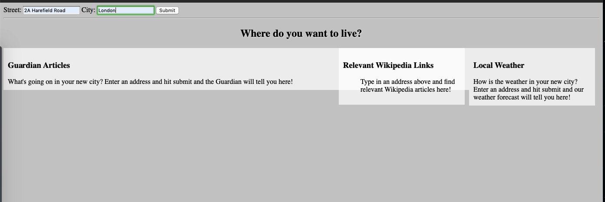
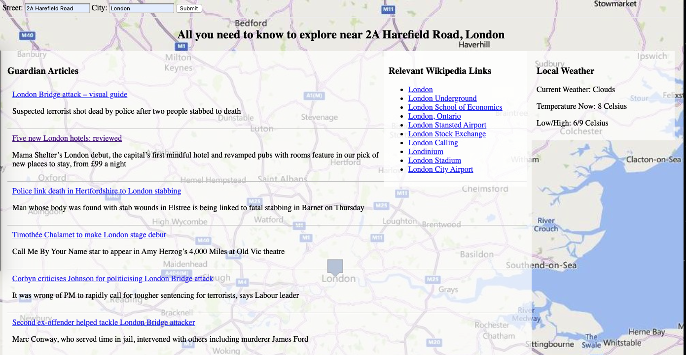
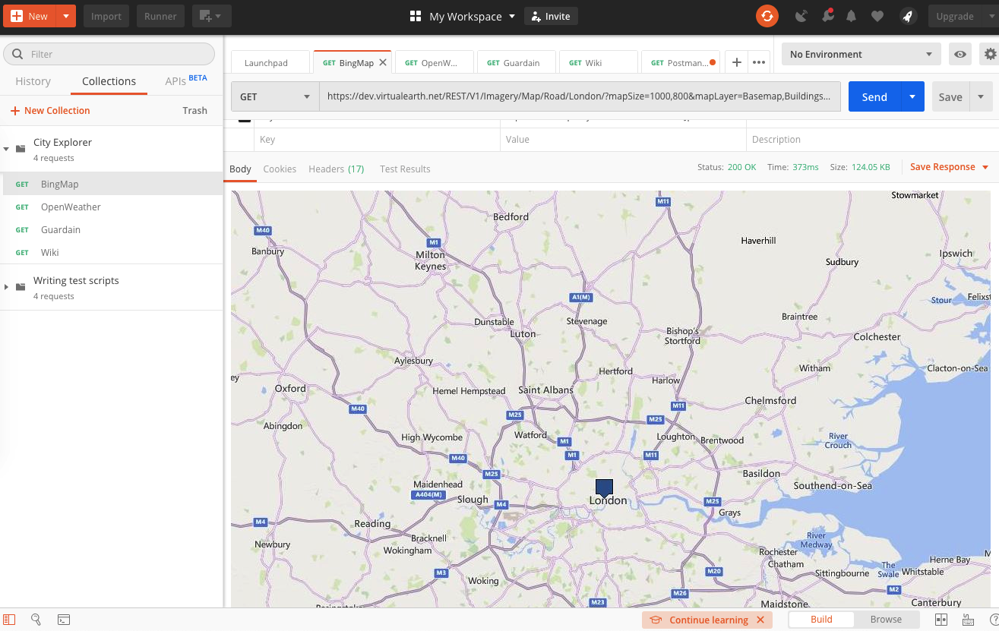
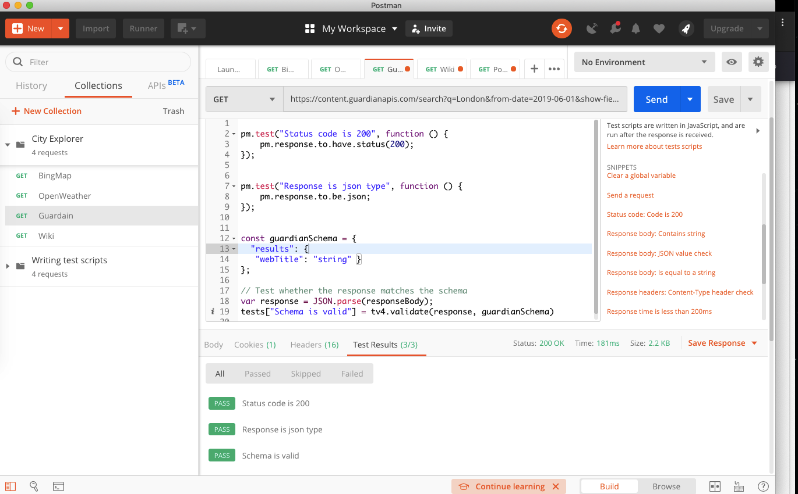

# City Explorer (JS)

## Introduction
The following project aims to help you navigate in a new city and provides you with basic information.

The idea of the project originates from week 7 curriculum at MakersAcademy when I was learning to make vanilla AJAX calls. Aside from the course materials, I was keen to understand the different ways to make AJAX API call in javascript so hence the project.

4 APIs are included in the project:
* https://open-platform.theguardian.com/
* https://www.mediawiki.org/wiki/API:Main_page
* https://openweathermap.org/
* https://www.microsoft.com/en-us/maps/choose-your-bing-maps-api

Of the 4 APIs, I took 3 different approach to make the API call:
* XMLHttpRequest (XHR)
* jQuery
* Fetch API

All code are written in javascript and are wrapped in class from ES6. A basic css file and html file are served to enable a single web page app.

## How to play with me
The app requires no configuration. There are 2 ways to interact with the app.

1. From Github
- git clone the repository to your local folder
- run `open index.html` from the directory

2. From Heroku
- The app is deployed on Heroku so you can simply visit `https://city-explorer-js.herokuapp.com/ `

Either way, once open, you can see a single page that takes 2 user input `street name` and `city name`. Input relevant data as you like and you can see:
* Relevant news in last 6 months
* Relevant wiki links
* Current weather
* A city map as background

## Test
There is no test library used for this project, however it is tested using Postman (https://www.getpostman.com/).

* note
When validate the response, to convert your API response result into correspondent JSON schema, I found this site particularly useful :https://jsonschema.net/

## Reflection
Since the main purpose of the project is to explore and compare the different ways to make API (in AJAX) calls, I noted down some of my feedback below:

* XMLHttpRequest

Using XMLHttpRequest is the most old fashioned way, but it does provide beginners like me with basic understanding of how Asynchronous HTTP request works. But to manipulate the response data, there are nice handy wrappers available and you probably have to investigate the documentation yourself. Also, methods like `.onreadystatechange` include some code that seems a bit duplicated, not concise.

* jQuery

jQuery is a client-side programming language you can be used to create cool web applications. The most amazing part of it is its simplicity and easy to learn. Something I didn't manage to explore this time but I heard a lot is its flexibility because jQuery allows users to add plug-ins. From a learner perspective, it has tons of support and documentation as well. So any drawbacks? Well, jQuery’s Ajax is 84 KB. If in a web application like mine, and I'm only use jQuery to make only a few requests, then It is not at all bandwidth friendly. Also, with Promises, you need to wrap jQuery in something like below:
`var jQueryPromise = $.ajax('/data.json');
var realPromise = Promise.resolve(jQueryPromise)`

* Fetch API

The Fetch API provides an interface for fetching resources.  The fetch method takes a mandatory request path as argument and returns a Promise. What I find really nice about it is its easy to use, and even the situation in my case is not that complicated, it seems that you can totally avoid *Callback hell* through promise chaining.

The only negative I've heard and not yet experienced is that it doesn't send cookie by default and that CORS is disabled by default.
